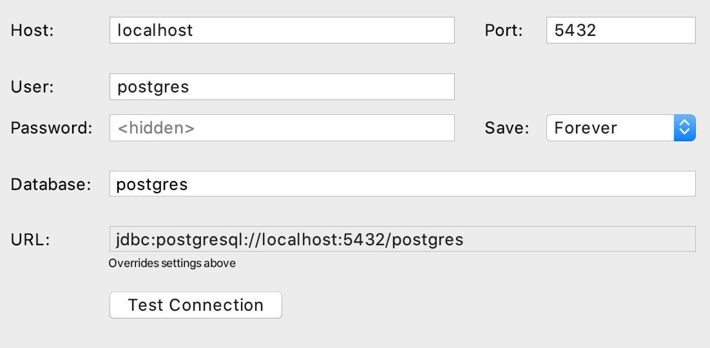

# scares-api
An API for the Capstone Project SCARES

### Dependencies
Install dependencies
```
$ pip install -r requirements.txt
```

### Running Postgres Locally
I find it easiest to run Postgres in a docker container. You can get a container up and running with this command.
```
docker run -d \
        --name dev-postgres \
        -e POSTGRES_PASSWORD=postgres \
        -p 5432:5432 \
        postgres
```

Then use DataGrip (or your preferred Postgres GUI) to view to the database.


# API Documentation
Currently hosted at `scares-api-dev.us-east-1.elasticbeanstalk.com`
### GET /healthcheck
Returns 200

### GET /getdata
Returns the processed data for a certain user and time.
Request path parameters required: `user_id` and `time`

### POST /user
Creates a new user entry. 
Body:
```
{
    "username": "name",
    "password": "good_password",
    "email": "mailymail@northwestern.edu"
}
```
### POST /data
Creates new raw gsr reading entries.
Request path parameters required: `user_id`

Body:
```
{
    "timestamps": ["2020-10-19 10:23:54+02","2020-10-19 10:24:54+02","2020-10-19 10:25:54+02",...],
    "gsr_values": [4.5,2.5,3,...]
}
```
